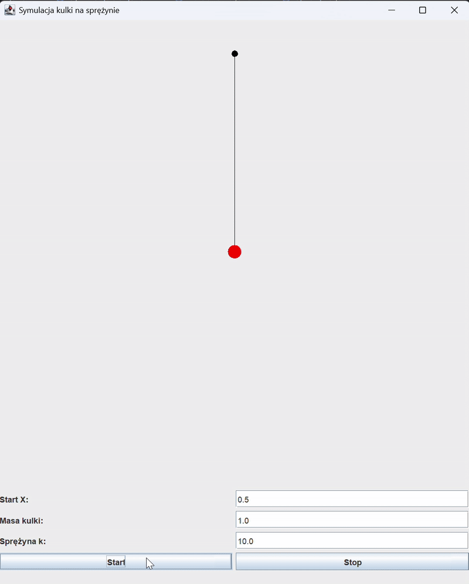

# Mass-Spring Simulation

Physics simulation of a ball bouncing on a spring. Watch it stretch, compress, and oscillate with real gravity and spring forces.

---

## What It Does

Simulates a ball attached to a spring. The ball bounces up and down based on:
- **Gravity** pulling it down
- **Spring force** pushing it back up
- **Mass** affecting how fast it moves

---

## Quick Start

### Run It
- Open project in IntelliJ (or any Java IDE)
- Run `Main.java`
- Ball starts bouncing automatically
- Change settings and click **Start** to restart

### Controls
- **Start X** - Initial position (0.5 = middle)
- **Masa kulki** - Ball mass (heavier = slower bounce)
- **Sprężyna k** - Spring stiffness (higher = stronger spring)
- **Start** - Begin simulation with new values
- **Stop** - Pause simulation

---

## How It Works

Spring Force + Gravity → Total Force → Acceleration → Velocity → Position

**Physics formulas:**
- Spring force: `Fs = -k × x` (Hooke's Law)
- Gravity force: `Fg = m × g`
- Total force: `Fw = Fg + Fs`
- Acceleration: `a = Fw / m`
- Velocity: `v = v₀ + a × dt`
- Position: `x = x₀ + v × dt`

---

## Tech Stack

**Language:** Java  
**Graphics:** Swing (JPanel, Graphics)  
**Physics:** Euler integration method  
**Update rate:** 100 FPS (10ms timer)

---

## Features

- Real-time spring physics simulation
- Adjustable parameters (mass, spring constant, start position)
- Visual spring stretching/compression
- Smooth animation with delta time
- Simple GUI with controls
- Pause/resume functionality

---

## Physics Explained

### Spring Force
When you stretch or compress a spring, it pushes back. The force is proportional to how far you stretch it:
- `Fs = -k × x`
- Negative sign = force opposes displacement
- Higher `k` = stiffer spring

### Gravity
Pulls the ball down constantly:
- `Fg = m × g` where `g = 9.81 m/s²`

### Result
Ball oscillates around equilibrium position where spring force equals gravity.

---

## Code Structure

Main.java - GUI setup, controls, timer  
Kulka.java - Ball object (mass, position, velocity) 
Sprezyna.java - Spring object (stiffness, length, ball) 
Polaczenie.java - Physics calculations (forces, updates) 
SymulacjaGUI.java - Drawing (spring line + ball circle) 

---

## Settings You Can Change

In GUI:
- **Start X:** Initial ball position (try 0.5 to 2.0)
- **Masa:** Ball mass in kg (try 0.5 to 5.0)
- **k:** Spring constant (try 5.0 to 50.0)

In code (`Polaczenie.java`):
- **G:** Gravity strength (default 9.81)
- **dt:** Time step (default 0.01, smaller = more accurate)

---

## Known Issues

- No damping (ball bounces forever)
- Uses Euler method (not super accurate for long simulations)
- Can't drag ball with mouse
- No spring coil visualization (just a line)
- Ball can go through floor if spring too weak

---

## What I Learned

- Spring physics and Hooke's Law
- Numerical integration (Euler method)
- Java Swing for graphics and controls
- Real-time simulation with timers
- Force calculations and Newton's laws
- Delta time for smooth animation

---

## Future Ideas

- Add damping (friction/air resistance)
- Use Runge-Kutta for better accuracy
- Draw coiled spring instead of line
- Mouse interaction (drag ball)
- Multiple springs and balls
- Graph showing position/velocity over time

>Built to learn basic physics simulation and Java Swing.

---

## Other Projects

* **Multiplayer Combat Game** - Real-time multiplayer game built with Spring Boot and JavaFX
* **Fluid Simulation SPH** — Physics simulation with 1000+ particles 
